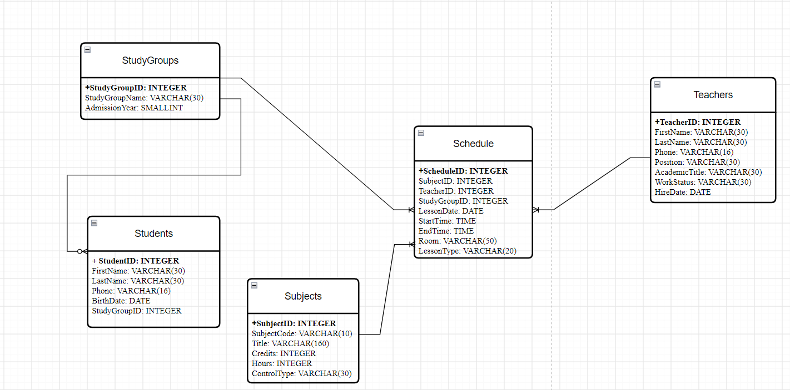

# Отчёт — Homework 2
## Сценарий: Система высшего образования

## Part 1: Выбор Сценария

Для данной работы выбран сценарий: **cистема высшего образования**.
Эта система будет управлять студентами, предметами, преподавателями, расписанием и группами.

## Part 2: Проектирование Базы Данных и Документация

### Идентификация Сущностей и Атрибутов

1. Студенты (Students)
2. Преподаватели (Teachers)
3. Предметы (Subjects)
4. Учебные группы (StudyGroups)
5. Расписание (Schedule) 

### Проектирование Таблиц

#### 1. Table Name: Students

- **Description:** Хранит информацию о студентах университета.
- **Attributes:**
  - StudentID: INTEGER, PK, NOT NULL
  - FirstName: VARCHAR(30), NOT NULL
  - LastName: VARCHAR(30), NOT NULL
  - Phone: VARCHAR(16), NOT NULL, UNIQUE
  - BirthDate: DATE, NOT NULL
  - StudyGroupID: INTEGER, FK (REFERENCES StudyGroups), NOT NULL
- **Constraints:**
  - PK_Students: PRIMARY KEY (StudentID)
  - UQ_Students_Phone: UNIQUE (Phone)
  - CHK_Students_BirthDate: CHECK (BirthDate < CURRENT_DATE)
  - FK_Students_StudyGroups: FOREIGN KEY (StudyGroupID) REFERENCES StudyGroups(StudyGroupID)

#### 2. Table Name: Teachers

- **Description:** Содержит информацию о преподавателях.
- **Attributes:**
  - TeacherID: INTEGER, PK, NOT NULL
  - FirstName: VARCHAR(30), NOT NULL
  - LastName: VARCHAR(30), NOT NULL
  - Phone: VARCHAR(16), NOT NULL, UNIQUE
  - Position: VARCHAR(30), NOT NULL
  - AcademicTitle: VARCHAR(30), NULL
  - WorkStatus: VARCHAR(30), NOT NULL, DEFAULT 'Active'
  - HireDate: DATE, NOT NULL
- **Constraints:**
  - PK_Teachers: PRIMARY KEY (TeacherID)
  - UQ_Teachers_Phone: UNIQUE (Phone)
  - CHK_Teachers_AcademicTitle: CHECK (AcademicTitle IS NULL OR AcademicTitle IN ('Docent', 'Professor', 'Corresponding Member', 'Academician'))
  - CHK_Teachers_WorkStatus: CHECK (WorkStatus IN ('Active', 'OnLeave', 'Fired'))
  - CHK_Teachers_HireDate: CHECK (HireDate <= CURRENT_DATE)

#### 3. Table Name: Subjects

- **Description:** Содержит информацию об учебных предметах.
- **Attributes:**
  - SubjectID: INTEGER, PK, NOT NULL
  - SubjectCode: VARCHAR(10), NOT NULL, UNIQUE
  - Title: VARCHAR(160), NOT NULL
  - Credits: INTEGER, NOT NULL
  - Hours: INTEGER, NOT NULL
  - ControlType: VARCHAR(30), NOT NULL, DEFAULT 'Exam'
- **Constraints:**
  - PK_Subjects: PRIMARY KEY (SubjectID)
  - UQ_Subjects_Code: UNIQUE (SubjectCode)
  - CHK_Subjects_Title: CHECK (Title <> '')
  - CHK_Subjects_Credits: CHECK (Credits >= 1 AND Credits <= 30)
  - CHK_Subjects_Hours: CHECK (Hours > 0)
  - CHK_Subjects_ControlType: CHECK (ControlType IN ('Exam', 'Credit', 'Differential Credit'))

#### 4. Table Name: StudyGroups

- **Description:** Содержит информацию об учебных группах университета.
- **Attributes:**
  - StudyGroupID: INTEGER, PK, NOT NULL
  - StudyGroupName: VARCHAR(30), NOT NULL, UNIQUE
  - AdmissionYear: SMALLINT, NOT NULL
- **Constraints:**
  - PK_StudyGroups: PRIMARY KEY (StudyGroupID)
  - UQ_StudyGroups_Name: UNIQUE (StudyGroupName)
  - CHK_StudyGroups_AdmissionYear: CHECK (AdmissionYear >= 2000 AND AdmissionYear <= 2100)

#### 5. Table Name: Schedule

- **Description:** Содержит информацию о расписании занятий. Реализует связь многие-ко-многим между группами и предметами.
- **Attributes:**
  - ScheduleID: INTEGER, PK, NOT NULL
  - SubjectID: INTEGER, FK (REFERENCES Subjects), NOT NULL
  - TeacherID: INTEGER, FK (REFERENCES Teachers), NOT NULL
  - StudyGroupID: INTEGER, FK (REFERENCES StudyGroups), NOT NULL
  - LessonDate: DATE, NOT NULL
  - StartTime: TIME, NOT NULL
  - EndTime: TIME, NOT NULL
  - Room: VARCHAR(50), NOT NULL
  - LessonType: VARCHAR(20), NOT NULL, DEFAULT 'Lecture'
- **Constraints:**
  - PK_Schedule: PRIMARY KEY (ScheduleID)
  - FK_Schedule_StudyGroups: FOREIGN KEY (StudyGroupID) REFERENCES StudyGroups(StudyGroupID)
  - FK_Schedule_Subjects: FOREIGN KEY (SubjectID) REFERENCES Subjects(SubjectID)
  - FK_Schedule_Teachers: FOREIGN KEY (TeacherID) REFERENCES Teachers(TeacherID)
  - CHK_Schedule_Time: CHECK (EndTime > StartTime)
  - CHK_Schedule_LessonType: CHECK (LessonType IN ('Lecture', 'Seminar', 'Lab', 'Exam'))
  - UQ_Schedule_StudyGroupTime: UNIQUE (StudyGroupID, LessonDate, StartTime)
  - UQ_Schedule_TeacherTime: UNIQUE (TeacherID, LessonDate, StartTime)
  - UQ_Schedule_RoomTime: UNIQUE (Room, LessonDate, StartTime)
  - CHK_Schedule_Room: CHECK (Room <> '')

### Взаимосвязи

- **StudyGroups и Students (один-ко-многим):** одна учебная группа может содержать много студентов, но каждый студент относится только к одной группе.
  - Students.StudyGroupID является внешним ключом, ссылающимся на StudyGroups.StudyGroupID.
- **Teachers и Schedule (один-ко-многим):** один преподаватель может провести много занятий, но каждая запись в расписании относится к одному преподавателю.
  - Schedule.TeacherID является внешним ключом, ссылающимся на Teachers.TeacherID.
- **Subjects и Schedule (один-ко-многим):** один предмет может проводиться много раз в расписании, но каждая запись в расписании относится к одному предмету.
  - Schedule.SubjectID является внешним ключом, ссылающимся на Subjects.SubjectID.
- **StudyGroups и Schedule (дин-ко-многим):** у одной группы может быть много занятий в расписании, но каждая запись в расписании относится к одной группе.
  - Schedule.StudyGroupID является внешним ключом, ссылающимся на StudyGroups.StudyGroupID.
- **StudyGroups и Subjects (многие-ко-многим):** одна группа может изучать много предметов, а один предмет может изучаться многими группами. Связь реализуется через таблицу Schedule.
  - Schedule.StudyGroupID является внешним ключом, ссылающимся на StudyGroups.StudyGroupID.
  - Schedule.SubjectID является внешним ключом, ссылающимся на Subjects.SubjectID.

## Part 3: ER-Диаграмма

